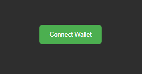

# Data Integrity Project

This project is a decentralized application (dApp) that leverages an Ethereum smart contract (deployed on, e.g., Sepolia) to securely upload, update, and verify data integrity. The frontend is built using React, and interactions with the smart contract are performed via ethers.js.


[](https://secureledger.onrender.com/)


## Table of Contents

- [Getting Started](#getting-started)
  - [Launching the Application](#launching-the-application)
  - [Navigating the Application](#navigating-the-application)
  - [Using the Data Operations Functionality](#using-the-data-operations-functionality)
- [Contract Deployment & Verification](#contract-deployment--verification)
- [Environment Variables](#environment-variables)
- [Linking Screenshots in Markdown](#linking-screenshots-in-markdown)
- [Additional Notes](#additional-notes)

## Getting Started

### Project prequesties

1. Ensure you have an Ethereum wallet extention, like MetaMask (you could get it from here: [MetaMask Extension](https://metamask.io/download/) ).
2. Set the sepolia testnet network on your wallet(just customise the networks on top left for metamask , and look for sepolia testnet network )[Set testnet](https://support.metamask.io/fr/configure/networks/how-to-view-testnets-in-metamask/).
3. Fund your account with sepolia testnet, you could use this faucet : [Sepolia faucet](https://cloud.google.com/application/web3/faucet/ethereum/sepolia)

### Launching the Application

1. Open your terminal and navigate to the project directory.
2. Run the following command to start the React development server:

   ```sh
   npm start
   ```

3. The application will launch in your browser.

   

### Navigating the Application

The app launches on a **Home Page**. In addition, there is an **About Page** and a **Service Page** (which we call "Data Operations" or "Data Integrity Portal" for clarity) where you can use all functionalities (upload, update, and verify data).

- **Home Page:**  
  A welcoming screen that may include introductory information or navigation links.

  **Screenshot:**  
  

- **About Page:**  
  This page is dedicated to provide some details about the project .

  

- **Data Operations (Service) Page:**

  Here, users navigate to use the three main functionalities:

  - **Data Upload:** Allows users to select a file (with the file’s name automatically set in the data name field, which is editable) and submit it along with a commit message.
  - **Data Update:** Similar to upload, but used for updating data. It also includes a button to check upload history.
  - **Data Verification:** This view requires the user to input the **Author Address** (i.e. the uploader’s address) and the data name (which must exactly match the name set by the uploader when deploying). Then, by selecting a file and clicking VERIFY, the system will check data integrity and display a detailed history of commits and timestamps.

  

### Using the Data Operations Functionality

Start first by clicking the `Connect wallet` button, to connect your wallet, and make sure you have setted the network to sepolia testnet, and have some funds :



your account address will be displayed


1.  **Data Upload:**

    

    - Navigate to the Data Operations page and click the **Data Upload** card.
    - You will see a drag-and-drop box for file selection. When you select a file, its name automatically fills in the data name field (which you can edit).

    

    - Enter your commit message and click **SUBMIT**.
    - Confirm the transaction on your ethereum wallet that will pop up.
    - On success, a small green popup will display that _File "X"_ has been uploaded successfully.

    

2.  **Data Update:**

    - Click the **Data Update** card on the Data Operations page.
    - The interface is similar to the Upload view but also includes a **Check Upload History** button.

    

    - Click the `Check Upload History` button to check your uploaded data and the upload timestamp .

    

    - After selecting a file and entering a commit message, click **SUBMIT** to update the data.
    - Confirm the transaction on your ethereum wallet that will pop up.
    - A green popup message will display the update result along with details from the transaction.

    

3.  **Data Verification:**

    - Click the **Data Verification** card.
    - You will see a drag-and-drop box for file selection. When you select a file, its name automatically fills in the data name field (which you can edit).

    

    - In this view, the commit field is replaced by an **Author Address** field. **Make sure the Author Address you fill in matches the uploader’s address used when the data was uploaded.**
    - Also, ensure that the Data Name is correctly entered (it should be exactly the same as set by the uploader)and click **VERIFY**.

    

    - A green popup will show a success message, and below it the interface will display the verification result, including a detailed list of commits and corresponding timestamps.

    

## Contract Deployment & Verification

For developers who wish to redeploy the smart contract on their own, follow these steps:

1. Make sure your `.env` file in the project root contains the following (replace the placeholder keys with your actual keys):

   ```ini
   SEPOLIA_PRIVATE_KEY="YOUR-KEY"
   INFURA_RPC_URL="https://sepolia.infura.io/v3/YOUR-KEY"
   ETHERSCAN_API_KEY="YOUR-KEY"
   ```

2. **Deploy the Contract:**  
   Use the deployment script (e.g., `deployProxy.js`) to deploy your contract. This script also updates the `address.json` file with your proxy address, by running the following command :

   ```sh
   npm run deployContract

   ```

3. **Verify Transactions on Etherscan:**  
   Check Etherscan for the transactions. You will see two contracts deployed:

   - The **Implementation Contract**
   - The **Proxy Contract** (the proxy address is saved in `address.json`)

4. **Verify the Implementation Contract:**  
   Copy the implementation contract address from Etherscan and run the following command:

   ```sh
   npx hardhat verify --network sepolia CONTRACT-ADDRESS
   ```

   **Note:** Replace `sepolia` with your network and `CONTRACT-ADDRESS` with your actual implementation contract address.

5. **Verify the Proxy Contract on Etherscan:**  
   On Etherscan, click "Other Options" for the proxy contract and select the "Proxy" option to verify that it is properly configured as a proxy.


## Additional Notes

- **Navigation:**  
  The app launches on the Home page. Users can navigate to the About page or the Data Operations page (formerly "Service") to use the smart contract functionalities.
- **Data Upload Field Behavior:**  
  When data is uploaded, the file's name is automatically set in the data name field. The user can edit this value if needed.
- **Data Verification Details:**  
  For data verification, users must fill in the **Author Address** (i.e., the uploader's address) and ensure that the Data Name is identical to the one set by the uploader when the data was deployed.

- **React Router Warnings:**  
  You might see warnings regarding React Router future flags; these are not related to the wallet connection or smart contract functionalities.
